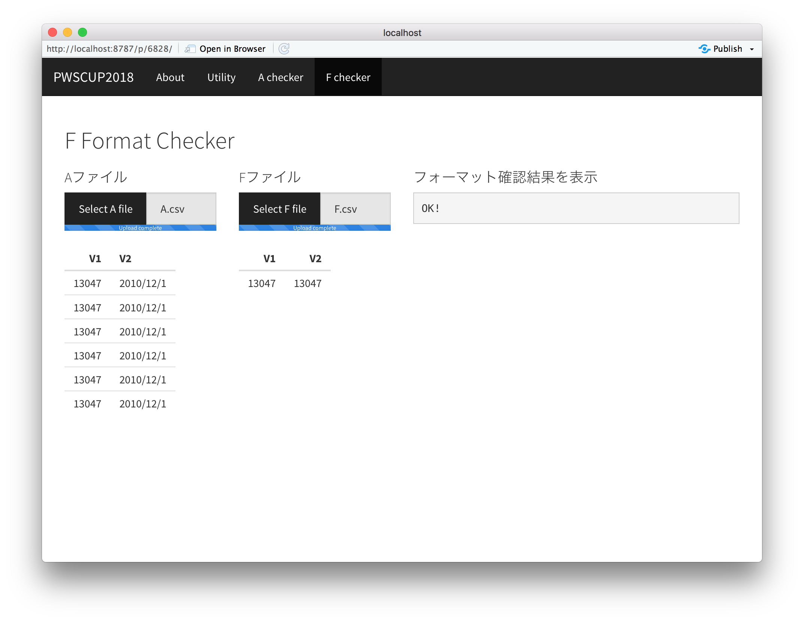

PWSCU2018 フォーマットチェッカー
===

## 使い方
1. docker composeが使える環境で、以下のコマンドを実行します

```bash
$ docker-compose up -d
```

2. ブラウザで http://localhost:3838/pwscup2018webapp/  にアクセス

3. フォーマットをチェックしたいデータをアップロードする





## 問い合わせ先

- 公式Twitter: https://twitter.com/PWScup_Admin
- 大会運営ML 

