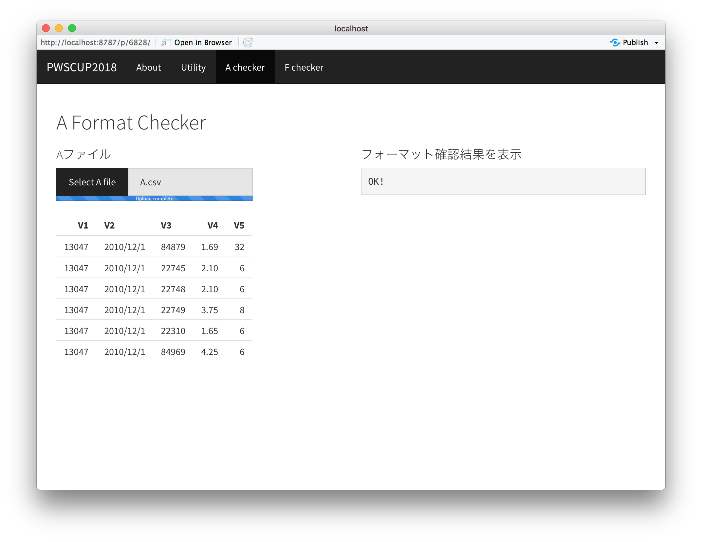

PWSCUP2018 フォーマットチェッカー (Ver. 1.4)
===

## 使い方
1. docker composeが使える環境で、以下のコマンドを実行します

```bash
$ docker-compose up -d
```

2. ブラウザで http://localhost:3838/pwscup2018webapp/  にアクセスします

3. 評価したいデータをアップロードします

- Aの有用性・安全性評価


- Aのチェック


- Fのチェック


## 問い合わせ先

- 公式Twitter: https://twitter.com/PWScup_Admin
- 大会運営ML 

